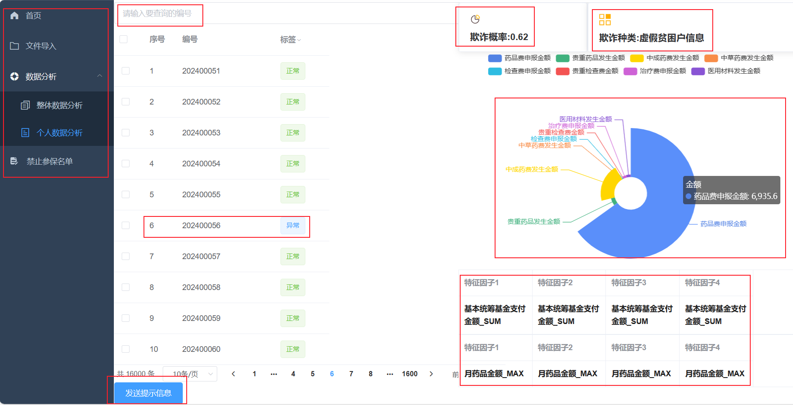
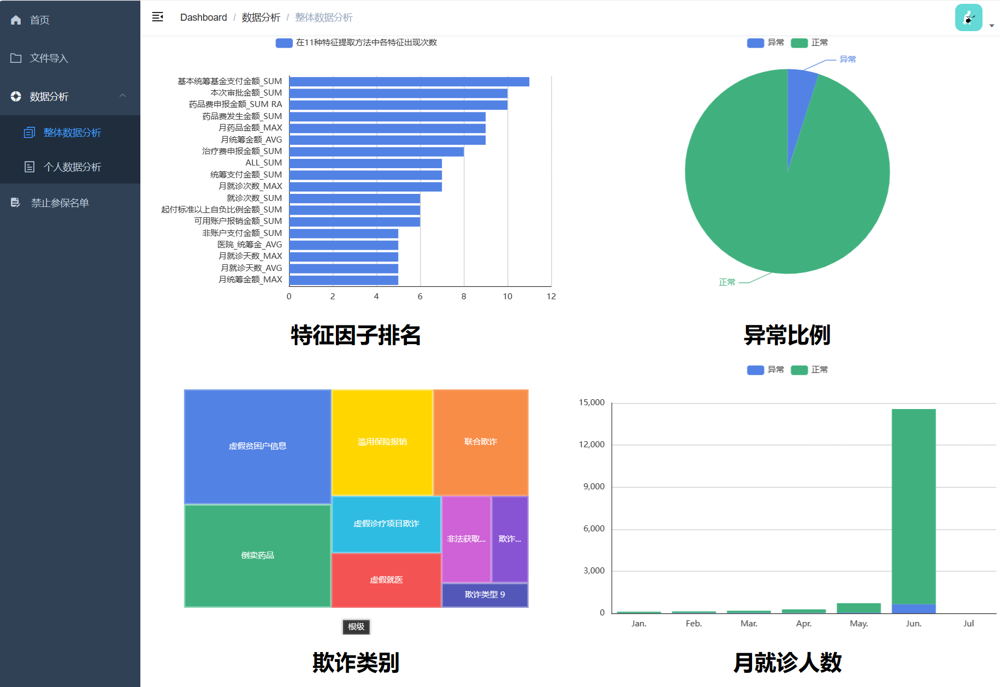

# Health Insurance Fraud Detection and Monitoring 

<p align="center">
    
</p>

<p align="center">
    
</p>

## Introduction

- The Algorithm folder contains the Feature Engineering、Cluster、Machine Learning algorithms etc.
- Frontend code、backend code folder contains the frontend code、backend code of the system
- The medicareDataNew.csv is the medical insurance fraud dataset

- Project_Overview.pdf is the summary of medical insurance fraud project

## Quick Start

- backend  

```
conda create -n med python==3.10
conda activate med
pip install -r requirements.txt
```

- Frontend 

```
# you should install node.js
npm install
npm run dev
```

## Video

[Introduction video](/images/introduction.mp4)

## Awards

- First Prize, China Computer Design Competition 
- Third Prize, China College Students Service Outsourcing Innovation and Entrepreneurship Competition
- Third Prize, China Robotics and Artificial Intelligence Competition
- Third Prize, Ruikang Robotics Developer Competition

If you have any questions or needs, feel free to contact me!